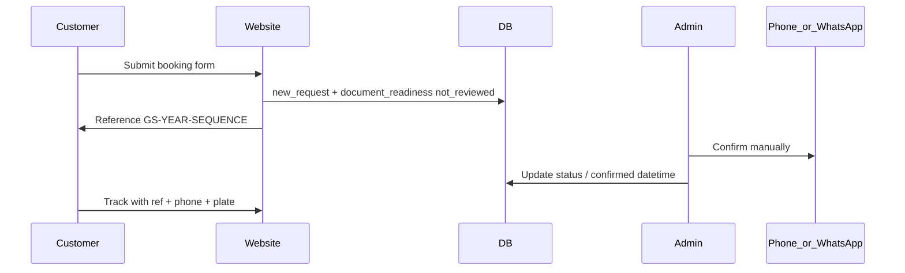

# Operational workflows — V1

**Step S005** · Statuses and behaviour for booking, tracking, contact, and content.

---

## 1. Booking intake

1. Customer submits request (sees non-auto-confirm message).  
2. System validates, creates `GS-{YEAR}-{SEQUENCE}`, status `new_request`, document status `not_reviewed`.  
3. Staff contact by phone/WhatsApp; set Confirmed / Rescheduled / Cancelled, etc.  
4. Customer tracks online.

**Booking statuses:** New Request · Pending Confirmation · Confirmed · Rescheduled · Cancelled · Completed · No-show

---

## 2. Appointment + document tracking

**Lookup requires all three:** booking reference · phone · vehicle registration.

**Show:** reference · agency · requested/confirmed datetime · booking status · document status · next action · public message · call/WhatsApp  

**Never show:** internal notes · admin names · inspection results · lane/machine data  

**Failed lookup (generic):**  
FR — *Nous n'avons pas trouvé de rendez-vous correspondant…*  
EN — *We could not find a matching booking…*

**Rules:** no plate-only lookup · rate-limit failures (e.g. 5 / 15 min / IP)

**Document statuses:** Not reviewed yet · Documents appear complete · Missing information · Please contact agency · Ready for visit

---

## 3. Contact

Submit → store as `new` (honeypot + rate limit) → admin email if configured → `in_review` → `responded` → `closed` (or `spam`). Agency Admin sees own agency only when assigned.

---

## 4. Content & tariffs

Articles: draft → published (FR+EN) · prefer evergreen updates over volume.  
Tariffs: Super Admin only · clear `is_placeholder` when official table arrives · audit changes · **never invent prices**.

---

## 5. What staff tell customers

Online booking is a **request**. Confirmation is by **phone/WhatsApp**. Tracking is **appointment + documents**, not live inspection. Bring original documents on the day.

---

## Related

[02-scope.md](02-scope.md) · [06-v1-v2-boundary.md](06-v1-v2-boundary.md) · [../02-requirements/03-roles-and-journeys.md](../02-requirements/03-roles-and-journeys.md)
