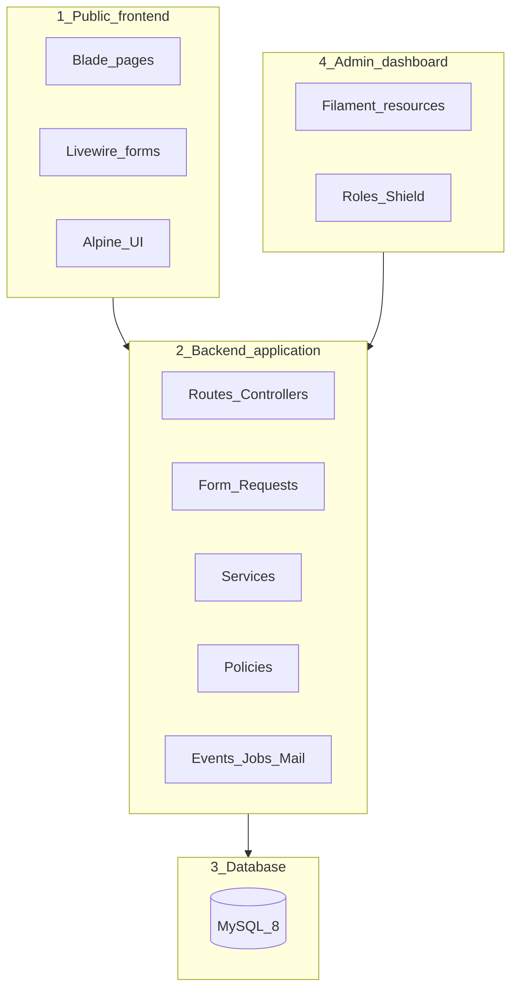
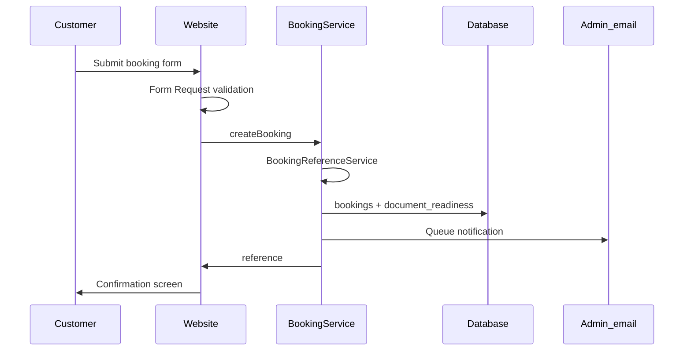
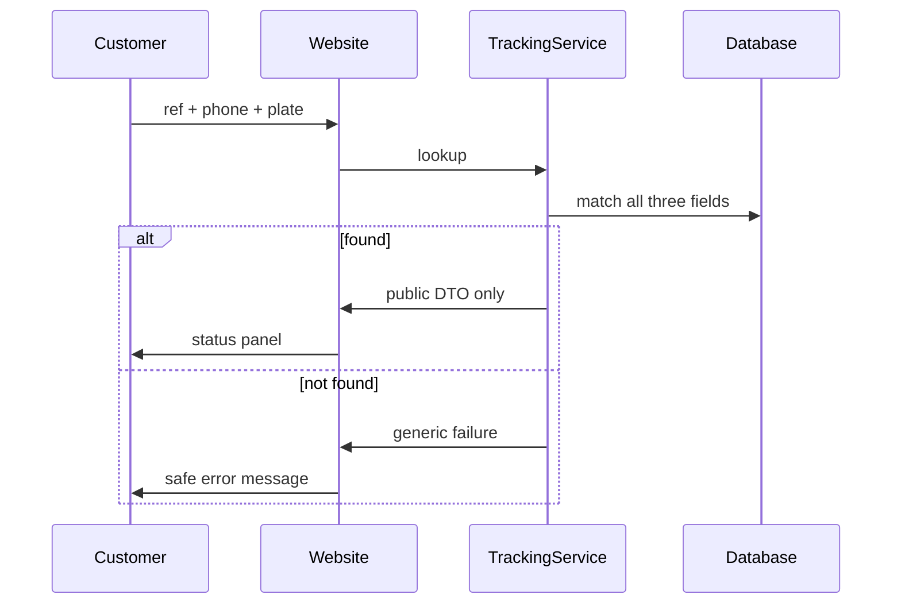

# System architecture overview — V1

**Project:** GS AUTOBILAN Official Website  
**Status:** Confirmed **S026** (2026-07-11) against running Laravel app  
**Stack in repo:** Laravel **13.19** · Livewire **4.3** · Filament **5.6** · MySQL (local 9.6 / target 8+) · Tailwind 4 · Vite 8  
**Related:** [02-module-boundaries.md](02-module-boundaries.md) · [03-permission-matrix.md](03-permission-matrix.md) · [../07-database/](../07-database/) · [../01-project-documentation/05-operational-workflows.md](../01-project-documentation/05-operational-workflows.md)

---

## 1. Purpose

Describe how the public site, backend, database, and admin dashboard work together for V1 — without inspection-lane or machine integration.

---

## 2. Four layers



| Layer | Responsibility | Tech | Repo status (S026) |
|-------|----------------|------|--------------------|
| **1. Public frontend** | Pages, language switch, booking/tracking/contact UI | Blade, Livewire 4, Alpine (via Livewire), Tailwind 4, Vite | Layout/partial/component **shells** exist (`resources/views/…`); pages not built yet |
| **2. Backend application** | Validation, business rules, references, safe lookup, notifications | Laravel routes, controllers, services, policies, events | Foundation only (`app/Http`, `app/Models/User`); services come in Block H |
| **3. Database** | Persistent data | MySQL + Eloquent | Connected DB `gs_autobilan`; default + permission/activity/media tables; domain schema in Block G |
| **4. Admin dashboard** | Staff CRUD, status updates, content, users | Filament 5 + Shield 4 | Panel at `/admin`; Super Admin user; Shield installed (roles wiring in Block I) |

**Confirmed:** The four-layer split matches the running app. Public and admin both sit on the same Laravel backend and MySQL database; no separate SPA or lane API.

---

## 3. Page classification

| Type | Pages | Data source |
|------|-------|-------------|
| Editable CMS | Home blocks, About, Visite Technique intro | Settings / page content |
| Dynamic DB | Agencies, Services, Tariffs, News, FAQ, Gallery, Testimonials | Eloquent models |
| Forms | Booking, Contact | POST → services → DB |
| Lookup | Appointment tracking | Read-only safe subset via TrackingService |

---

## 4. High-level request flows

### 4.1 Public page view

`Browser → Locale route → Controller/Livewire → ContentService/Model → Blade → HTML`

### 4.2 Booking submit



### 4.3 Tracking lookup



### 4.4 Admin status update

`Admin → Filament → Policy check → Model update → Activity log → Public tracking reflects new status`

---

## 5. Backend internal structure

```
Routes
  → Controllers (thin) / Livewire
    → Form Requests
      → Services (business logic)
        → Models / DB
      → Policies (authorization)
      → Events → Listeners → Mail / Jobs
      → AuditLog (activitylog)
```

### Core services (V1)

| Service | Role |
|---------|------|
| `BookingReferenceService` | `GS-{YEAR}-{SEQUENCE}` |
| `BookingService` | Create booking + readiness; notify |
| `TrackingService` | Safe public lookup |
| `DocumentReadinessService` | Default + admin updates |
| `ContactMessageService` | Store + notify |
| `ContentService` | Active bilingual content |
| `SEOService` | Meta, canonical, hreflang helpers |
| `MediaService` | Safe uploads |
| `AuditLogService` | Sensitive change summaries (via Spatie) |

---

## 6. Locale architecture

- Default: `fr` · Fallback: `en` · Timezone: `Africa/Douala` (**set in `.env` / `config/app.php`**)
- URL prefix: `/fr/...` · `/en/...`
- Root `/` → `/fr/accueil`
- CMS: `_fr` / `_en` columns
- UI chrome: structured PHP translation files under `lang/fr/` · `lang/en/`
- Middleware: `SetLocale` (Block M)

---

## 7. Integration boundaries (V1)

| Allowed | Not allowed |
|---------|-------------|
| Email notifications (admin; optional customer) | WhatsApp Business API / SMS APIs |
| `wa.me` and `tel:` deep links | Online payment gateways |
| Manual staff confirmation | Machine / lane status APIs |
| Filament file uploads | Customer login portal |

---

## 8. Security architecture (summary)

- Public: CSRF, Form Requests, rate limits, honeypot
- Admin: auth + roles + agency scoping policies
- Tracking: triple-field match; generic errors; no PII in logs
- Production: HTTPS, debug off, backups

**Confirmed at S025:** `/admin` requires login; Filament uses `Authenticate` + `PreventRequestForgery`; public layout exposes CSRF meta.

Detail steps: S077–S079 in [../STEPS.md](../STEPS.md)

---

## 9. Deployment architecture (later)

```
Local app → stabilize → Docker Compose
  (app, nginx, mysql, redis, worker, scheduler)
  → VPS + reverse proxy + SSL
```

See [../03-local-environment/02-environments.md](../03-local-environment/02-environments.md) and steps S087–S091.

---

## 10. What this architecture deliberately excludes

- Inspection-lane state machine
- Certificate / QR verification
- Fleet multi-vehicle portal
- Real-time machine results

See [../01-project-documentation/06-v1-v2-boundary.md](../01-project-documentation/06-v1-v2-boundary.md).
