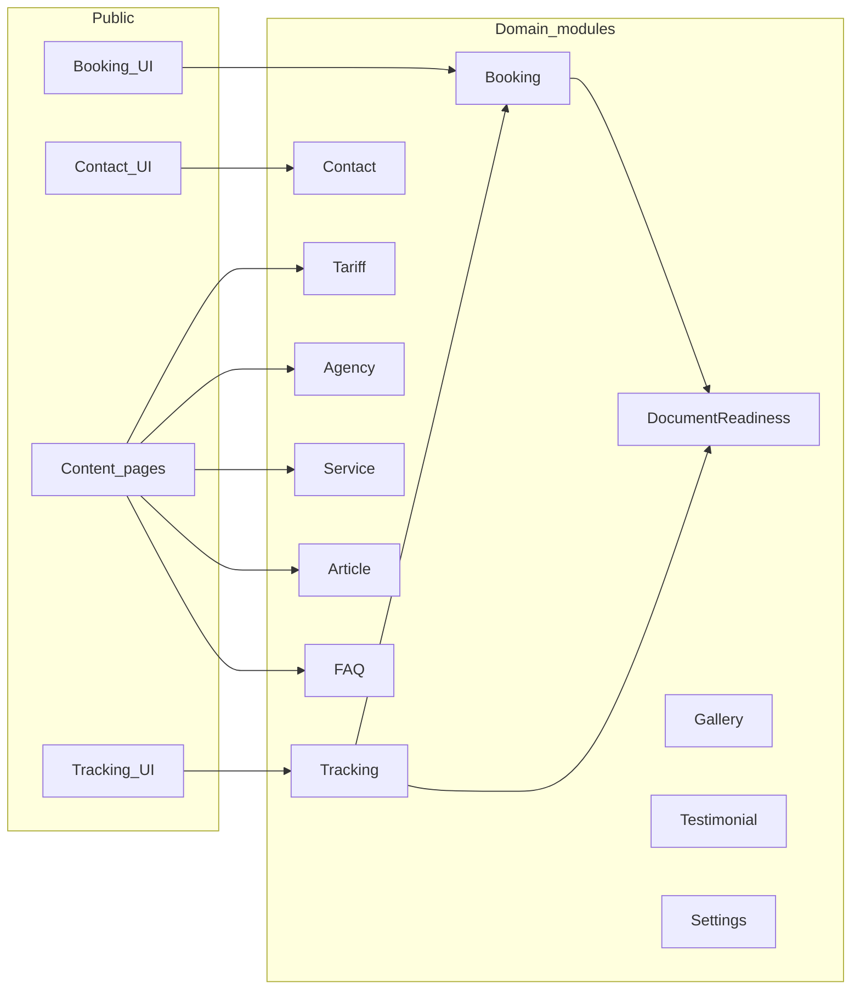

# Module boundaries — V1

**Project:** GS AUTOBILAN Official Website  
**Status:** Locked for V1  
**Related:** [01-architecture-overview.md](01-architecture-overview.md)

---

## 1. Rule

Each module owns **one responsibility**. Do not mix booking intake logic into tracking display, or inspection education into booking statuses.

---

## 2. Module map

---

## 3. Boundaries (strict)

| Module | Owns | Must not own |
|--------|------|--------------|
| **Booking** | Intake create, reference, booking status workflow, confirmed datetime, public/internal booking messages | Document checklist details beyond creating default readiness; inspection results |
| **DocumentReadiness** | Document status, missing info, next action, public readiness message | Changing booking status; lane/inspection results |
| **Tracking** | Public lookup orchestration; mapping DB → safe DTO | Writing bookings; exposing internal notes |
| **Contact** | Contact form messages and their statuses | Bookings |
| **Tariff** | Price rows, placeholder flag, validity, PDF export data | Payments |
| **Agency** | Agency profile, hours, geo, phones | Booking business rules |
| **Service** | Service catalogue | Pricing (tariffs module) |
| **Article / FAQ / Gallery / Testimonial** | CMS content | Operational booking data |
| **Settings** | Slogan, DG, logo, SEO defaults | Per-booking data |
| **Users / Roles** | Admin accounts and permissions | Public customer accounts (none in V1) |

---

## 4. Status ownership

| Status family | Owner module | Where shown publicly |
|---------------|--------------|----------------------|
| Booking statuses | Booking | Tracking result |
| Document statuses | DocumentReadiness | Tracking result |
| Contact statuses | Contact | Admin only |
| Article statuses | Article | News (published only) |
| Accepté / Suspendu / Refusé | **Neither** (educational copy on Visite Technique only) | Visite Technique page text — **not** booking/tracking enums |

---

## 5. Cross-module allowed interactions

| From | To | Allowed interaction |
|------|----|---------------------|
| Booking | DocumentReadiness | Create default row on booking create |
| Tracking | Booking + DocumentReadiness | Read for public DTO |
| Admin Filament | Booking / DocReady / Contact / CMS | Update via policies |
| Agency | Booking / Contact / Gallery | Foreign keys / filters |

---

## 6. Suggestion

When adding a feature, ask: “Which single module owns this?” If the answer is two modules, split the work or reject it for V1.
